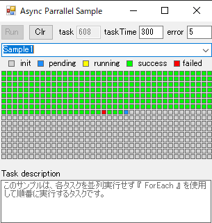
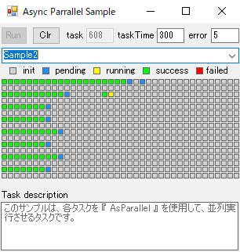
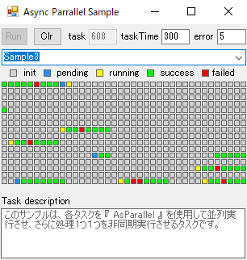
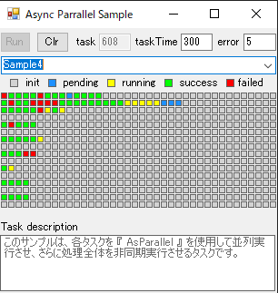

# Async Parallel Sample

  
This is a sample source code to check asynchronous and parallel processing.  
It was created based on [this article](https://qiita.com/longlongago_k/items/8f19d84fce6dd677922e), but I have not checked the actual source code, so it differs from the article.

## Demo
### Foreach pattern

### Parallel For pattern

### Parallel And Task(part) pattern

### Parallel And Task(all) pattern

## Contributing
Pull requests and stars are always welcome. Contributions are what make the open source community such an amazing place to be learn, inspire, and create.
Any contributions you make are greatly appreciated.

1. Fork the Project.
2. Create your Feature Branch(`git checkout -b feature/amazing_feature`).
3. Commit your Changes(`git commit -m 'Add some changes'`).
4. Push to the Branch(`git push origin feature/amazing_feature`).
5. Open a Pull Request.

## Reference
- [(C#)Parallel.For, Parallel.ForEach並列処理の挙動確認](https://qiita.com/longlongago_k/items/8f19d84fce6dd677922e)

Thanks for the great article.

## License
MIT license. Check [here](https://github.com/atEaE-samples/async-parrallel-sample/blob/master/LICENSE) for license details.